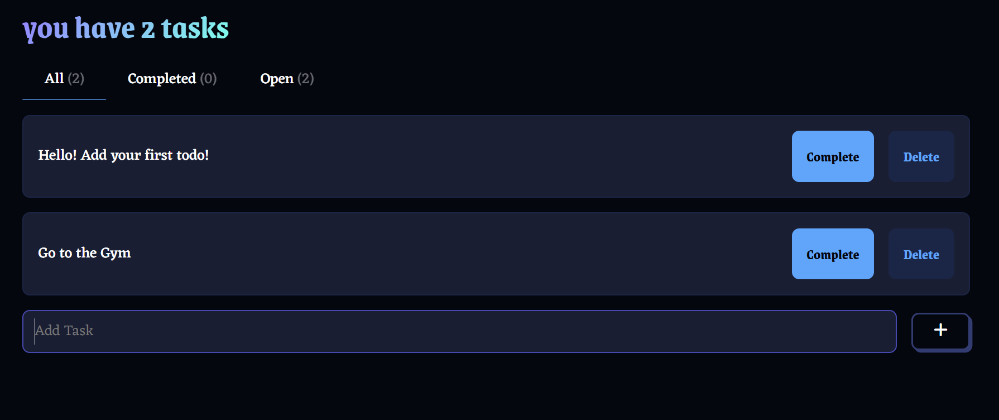

# ✨ React Todo Application

A modern, responsive Todo application built with React, featuring a clean UI and local storage persistence. Manage your tasks efficiently with basic CRUD operations and filtering capabilities.


## [Demo](https://my-super-todoapp.netlify.app/)
## � Screenshot



## �🚀 Features

- ✅ Create, Read, Update, and Delete todos
- 🔍 Filter todos by status (All, Open, Completed)
- 💾 Persistent storage using localStorage
- ⌨️ Keyboard shortcuts for quick task addition
- 📱 Responsive design for all devices

## 🛠️ Technologies Used

- React.js
- Vite
- CSS for styling
- Local Storage API
- Font Awesome icons

## 💻 Getting Started

### Prerequisites

- Node.js (v14 or higher)
- npm or yarn

### Installation

1. Clone the repository:

```bash
git clone [your-repo-link]
```

2. Navigate to the project directory:

```bash
cd react-todo-app
```

3. Install dependencies:

```bash
npm install
```

4. Start the development server:

```bash
npm run dev
```

## 🎯 Usage

1. **Adding a Todo**:

   - Type your task in the input field
   - Press Enter or click the '+' button

2. **Completing a Todo**:

   - Click the checkbox next to the todo

3. **Editing a Todo**:

   - Click the edit icon to modify the todo
   - The text will appear in the input field
   - Make your changes and submit

4. **Deleting a Todo**:

   - Click the delete icon to remove the todo

5. **Filtering Todos**:
   - Use the tabs to filter between All, Active, and Completed todos

## 🌟 Key Features Explained

### Local Storage Persistence

The application automatically saves your todos to the browser's local storage, ensuring your tasks persist between sessions.

### Responsive Design

The UI adapts seamlessly to different screen sizes, providing a consistent experience across devices.

### Keyboard Support

Enhance productivity with keyboard shortcuts:

- `Enter`: Add new todo
- Quick focus management for smooth task entry

## 📝 Component Structure

- `App.jsx`: Main component managing state and CRUD operations
- `Header.jsx`: Displays the application header
- `Tabs.jsx`: Handles filtering functionality
- `TodoList.jsx`: Renders the list of todos
- `TodoCard.jsx`: Individual todo item component
- `TodoInput.jsx`: Handles new todo input


## 📜 License

This project is open source and available under the [MIT License](LICENSE).
[courseLink](https://github.com/jamezmca/reactjs-full-course)
